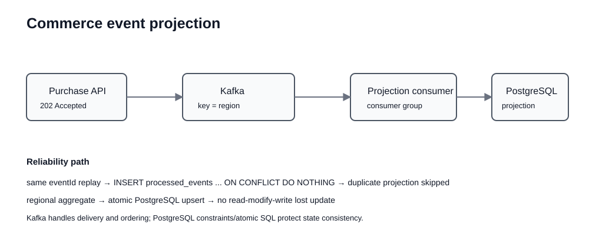

# Commerce Event Pipeline

기존 E-commerce 분석 데이터를 출발점으로, 구매 이벤트를 **Spring Boot → Kafka → idempotent consumer → PostgreSQL projection**으로 처리하는 event-driven backend 프로젝트입니다.

초기 프로젝트는 SQL과 Excel을 사용해 지역, 상품, 기온 데이터를 결합하고 판매 패턴을 분석하는 데 집중했습니다. V2에서는 이 분석 결과가 실제 서비스에서 생성되는 구매 이벤트를 어떻게 안전하게 집계할 수 있을지로 문제를 확장했습니다.

이 저장소의 핵심 질문은 다음과 같습니다.

> **동일한 구매 이벤트가 네트워크 재시도나 Kafka 재전달로 두 번 도착해도 집계 결과를 한 번만 반영하려면 어떻게 설계해야 하는가?**

---

## 1. Executive Summary

기존 데이터 분석 프로젝트에서는 지역별 구매 특성을 SQL/Excel로 분석했습니다. 하지만 실서비스에서는 분석용 데이터가 처음부터 완성된 CSV로 주어지지 않습니다. 구매 요청이 실시간으로 발생하고, 이벤트가 재전달될 수 있으며, 여러 consumer가 서로 다른 목적으로 같은 이벤트를 사용할 수 있습니다.

그래서 V2에서는 다음 구조를 구현했습니다.

```text
Client
  │
  │ POST /api/v1/purchases
  │ Idempotency-Key: UUID
  ▼
Spring Boot API
  │
  │ publish
  ▼
Kafka topic: purchase-events
  │
  ▼
PurchaseEventConsumer
  │
  ▼
Transactional Projection Service
  │
  ├─ processed_events
  │    └─ duplicate event guard
  │
  └─ regional_sales
       └─ atomic aggregate update
```

API는 이벤트를 동기 집계하지 않고 **`202 Accepted`**를 반환합니다. 최종 집계는 consumer가 처리합니다.

이 프로젝트는 전체 포트폴리오에서 `Kafka / Event-driven / Idempotent Consumer / Projection` 역할을 담당합니다.

---

## 2. From Analytics to Event-driven Backend

초기 프로젝트의 문제는 다음과 같았습니다.

```text
CSV / Excel
   ↓
SQL aggregate
   ↓
Visualization
```

이 구조는 이미 쌓여 있는 데이터를 분석하기에는 충분하지만 다음 질문에는 답하기 어렵습니다.

- 구매 이벤트가 초당 계속 들어오면 어떻게 집계할 것인가?
- 주문 API가 집계까지 기다려야 하는가?
- 같은 이벤트가 두 번 도착하면 총매출이 두 번 증가하지 않는가?
- 지역별 처리 순서를 유지해야 한다면 partition key를 무엇으로 잡을 것인가?
- 분석 외에 추천, 알림, 감사 로그가 같은 이벤트를 사용하려면 어떻게 분리할 것인가?

그래서 "데이터 분석"을 없애지 않고, **분석 대상 데이터가 생성되는 backend pipeline을 추가**했습니다.

---

## 3. Architecture



```text
┌───────────────────────────┐
│ Purchase Client           │
└─────────────┬─────────────┘
              │
              ▼
┌───────────────────────────┐
│ Spring Boot Purchase API  │
│ validation                │
│ event id from header      │
└─────────────┬─────────────┘
              │
              │ Kafka publish
              ▼
┌───────────────────────────┐
│ purchase-events           │
│ key = region              │
└─────────────┬─────────────┘
              │
              ▼
┌───────────────────────────┐
│ PurchaseEventConsumer     │
└─────────────┬─────────────┘
              │
              ▼
┌───────────────────────────┐
│ Projection Transaction    │
├───────────────────────────┤
│ 1. tryInsert(event_id)    │
│ 2. if new → increment     │
│ 3. if duplicate → no-op   │
└─────────────┬─────────────┘
              │
              ▼
┌───────────────────────────┐
│ PostgreSQL                │
│ processed_events          │
│ regional_sales            │
└───────────────────────────┘
```

---

## 4. Why Kafka?

Kafka를 단순히 "대용량이라서" 사용하지 않았습니다.

이 프로젝트에서 해결하려는 핵심 요구는 **한 번 발생한 구매 사실을 여러 downstream 처리에서 독립적으로 소비할 수 있는 event stream으로 남기는 것**입니다.

### Alternatives

#### Option A. API에서 DB aggregate를 직접 업데이트

장점:
- 가장 단순함
- 즉시 결과 반영

단점:
- 구매 API latency가 집계 작업과 결합됨
- 분석, 알림, 추천 등 consumer가 늘수록 API 책임 증가
- downstream 장애가 사용자 요청에 직접 전파될 수 있음

#### Option B. 일반 DB Queue

장점:
- 작은 규모에서는 충분히 단순함

단점:
- 여러 독립 consumer와 replay 요구가 커질수록 관리가 어려움

#### Option C. Kafka

선택 이유:
- event를 durable log로 남길 수 있음
- consumer group으로 독립 처리 가능
- partition 단위 ordering 제공
- replay 가능

따라서 이 프로젝트에서는 **구매 요청 처리와 분석 projection을 분리하는 문제**에 Kafka가 자연스럽다고 판단했습니다.

---

## 5. API Contract

### Purchase Event

```http
POST /api/v1/purchases
Idempotency-Key: 3c0c6c8e-...
Content-Type: application/json
```

Request concept:

```json
{
  "customerId": 1001,
  "category": "Outerwear",
  "region": "New York",
  "amount": 129.90
}
```

Response:

```http
202 Accepted
```

```json
{
  "eventId": "3c0c6c8e-...",
  "status": "ACCEPTED"
}
```

`202`를 반환하는 이유는 HTTP 요청 시점에 최종 regional projection까지 완료되었다고 보장하지 않기 때문입니다.

### Analytics

```http
GET /api/v1/analytics/regions
```

이 API는 consumer가 만든 PostgreSQL projection을 조회합니다.

---

## 6. Event Model

`PurchaseEvent`는 downstream consumer가 처리하기 위한 최소 계약입니다.

```text
eventId
customerId
category
region
amount
occurredAt
```

여기서 가장 중요한 필드는 `eventId`입니다.

Kafka의 일반적인 consumer processing은 **at-least-once** 상황에서 동일 event를 다시 받을 수 있습니다. 따라서 "Kafka에 보냈으니 딱 한 번 처리된다"고 가정하지 않습니다.

---

## 7. Idempotent Consumer

중복 이벤트 문제를 다음처럼 다룹니다.

```text
Event A 도착
   ↓
processed_events에 event_id INSERT 시도
   ↓
┌───────────────┬────────────────┐
│ inserted = 1  │ inserted = 0   │
│ new event     │ duplicate      │
└───────┬───────┴───────┬────────┘
        │               │
        ▼               ▼
regional_sales       no-op
increment
```

현재 `PurchaseProjectionService`는 하나의 transaction 안에서:

1. `processed_events.tryInsert(eventId)`
2. 이미 처리된 ID면 종료
3. 새 이벤트면 `regional_sales` 증가

를 수행합니다.

이 구조의 핵심은 **"consumer가 한 번만 호출될 것"을 믿는 것이 아니라 최종 effect를 idempotent하게 만든 것**입니다.

---

## 8. Why `processed_events` + DB Constraint?

중복 방지를 application memory의 `Set<UUID>`로 처리할 수도 있습니다.

하지만 애플리케이션이 여러 대라면 각 process memory는 공유되지 않고 재시작 시 기록도 사라집니다.

따라서 PostgreSQL을 shared source of truth로 사용합니다.

```text
processed_events
└─ event_id PRIMARY KEY
```

동일 event ID의 insert 경쟁은 DB constraint가 최종적으로 결정합니다.

이 방식은 Redis distributed lock보다 문제에 더 작은 해결책입니다. 현재 요구는 "동일 작업을 동시에 실행하지 말자"보다 **"같은 event의 최종 효과를 한 번만 반영하자"**이므로 unique key + transaction이 더 직접적입니다.

---

## 9. Projection Update and Lost Update

지역별 매출은 여러 consumer invocation이 같은 region row를 동시에 갱신할 수 있습니다.

나쁜 방식:

```text
SELECT total
application: total += amount
UPDATE total
```

동시에 두 요청이 같은 값을 읽으면 하나의 증가분이 사라지는 Lost Update가 발생할 수 있습니다.

그래서 repository는 PostgreSQL에서 atomic upsert/increment 형태로 집계를 갱신하도록 구성합니다.

핵심 원칙:

> 공유 숫자를 수정할 때는 가능한 한 read-modify-write를 애플리케이션으로 끌어오지 않고 DB atomic statement로 해결합니다.

---

## 10. Partition Key Decision

Kafka ordering은 topic 전체가 아니라 **partition 내부**에서 보장됩니다.

이 프로젝트에서는 `region`을 message key로 사용합니다.

```text
New York events  → same partition
Texas events     → same partition
California       → same partition
```

선택 이유는 projection의 주요 집계 단위가 region이기 때문입니다.

### Trade-off

장점:
- 같은 region 이벤트의 상대적 순서를 유지하기 쉬움
- aggregate locality가 명확함

단점:
- 특정 region에 트래픽이 집중되면 hot partition이 될 수 있음

따라서 실제 트래픽에서 지역 편중이 심하면 `region + bucket` 또는 다른 partition strategy를 다시 검토해야 합니다.

---

## 11. Transaction Boundary

Projection 처리의 핵심 DB mutation은 하나의 transaction으로 묶습니다.

```text
BEGIN
  INSERT processed_event
  UPDATE regional_sales
COMMIT
```

첫 insert는 성공했지만 aggregate update가 실패한 채 commit되면 다음 retry에서 duplicate로 판단되어 실제 매출이 누락될 수 있습니다.

그래서 두 작업을 같은 transaction에 둡니다.

이것이 이 프로젝트의 중요한 consistency point입니다.

---

## 12. Failure Scenarios

### Case 1. Producer request succeeds, event publish fails

현재 API는 publisher 호출 중 실패하면 정상 `202`로 응답해서는 안 됩니다. 향후 producer reliability를 더 강화한다면 Outbox Pattern이 후보입니다.

```text
DB transaction
  ├─ business state
  └─ outbox event
        ↓
background publisher
        ↓
Kafka
```

현재 프로젝트는 구매 business transaction 자체를 저장하는 full commerce service가 아니므로 outbox를 구현 완료 기능처럼 표현하지 않습니다.

### Case 2. Consumer processes event then crashes before offset commit

Kafka가 event를 다시 전달할 수 있습니다.

```text
same event
   ↓
processed_events conflict
   ↓
no-op
```

이 경우 idempotent consumer가 duplicate effect를 막습니다.

### Case 3. Poison message

현재는 완전한 DLQ 운영 구성을 구현하지 않았습니다. schema validation이나 business invariant를 반복해서 위반하는 이벤트가 존재할 경우 retry 횟수 제한 + DLQ가 다음 단계입니다.

### Case 4. Kafka unavailable

API의 event acceptance와 broker publish 전략을 분리하려면 Outbox나 durable local persistence를 검토해야 합니다. 현재는 broker dependency를 명시적으로 드러내는 구조입니다.

---

## 13. Experiment: Duplicate Replay

`experiments/replay_duplicate.py`는 동일 event ID를 반복 전송해 duplicate 처리 경계를 검증하기 위한 실험 harness입니다.

실험 질문:

```text
same event UUID를 N번 전송하면
regional_sales는 몇 번 증가하는가?
```

기대 결과:

```text
requests received: N
unique event effect: 1
```

실제 환경에서 검증할 때는 다음을 함께 기록합니다.

- duplicate requests
- processed_events row count
- regional_sales delta
- consumer error count

측정하지 않은 throughput 숫자는 README에 작성하지 않습니다.

---

## 14. Test Strategy

현재 테스트의 핵심은 consumer idempotency 계약입니다.

검증 범위:

- 새 event가 projection에 반영되는가
- duplicate event가 다시 aggregate를 증가시키지 않는가
- repository/service contract가 예상대로 동작하는가

GitHub Actions에서는 Java 17 환경에서:

```bash
mvn -B verify
```

를 실행합니다.

현재 main service CI는 성공 상태를 유지합니다.

---

## 15. Technology Stack

| Area | Technology | Responsibility |
|---|---|---|
| API | Java 17, Spring Boot 4.1.1 | purchase ingestion / analytics |
| Messaging | Spring Kafka | event publish / consume |
| Broker | Kafka | durable event stream |
| Database | PostgreSQL | dedup record / projection |
| Migration | Flyway | schema versioning |
| Validation | Jakarta Validation | API contract |
| Operations | Spring Actuator | health/operational endpoint |
| Test | Spring Boot Test | service contract |
| Infra | Docker Compose | local Kafka/PostgreSQL |

---

## 16. Why Not Redis Lock?

중복 이벤트를 막기 위해 Redis lock을 먼저 사용하지 않았습니다.

Redis lock은 여러 process가 동일 critical section을 동시에 실행하지 않게 조정할 때 유용합니다. 하지만 이 프로젝트의 핵심 요구는 **retry가 발생해도 최종 aggregate effect가 한 번이어야 한다는 것**입니다.

따라서:

```text
Idempotency problem
→ event id
→ unique constraint
→ transactional effect
```

가 더 직접적입니다.

분산락은 DB unique constraint와 transaction으로 해결되지 않는 별도 coordination 문제가 생겼을 때 검토합니다.

---

## 17. Why Not Exactly-once Claim?

README에서는 "exactly once를 구현했다"고 표현하지 않습니다.

Kafka와 외부 DB를 함께 사용하는 시스템에서 end-to-end exactly-once는 단순 producer 설정 하나로 보장되지 않습니다.

현재 설계가 주장하는 것은 더 좁고 검증 가능한 내용입니다.

> **동일 event ID가 재전달되어도 PostgreSQL projection의 최종 effect가 중복되지 않도록 idempotent consumer를 구현했다.**

이 차이를 면접에서 명확히 설명할 수 있어야 합니다.

---

## 18. Repository Structure

```text
.
├── e-commerce_data.xlsx
├── add_data_analysis.xlsx
├── original presentation.pptx
│
├── service/
│   ├── pom.xml
│   └── src/
│       ├── main/java/dev/kangwoul/commerce/
│       │   ├── purchase/
│       │   ├── projection/
│       │   └── config/
│       ├── main/resources/
│       │   ├── application.yml
│       │   └── db/migration/
│       └── test/
│
├── experiments/
│   └── replay_duplicate.py
│
├── docs/
│   ├── ARCHITECTURE_DECISIONS.md
│   ├── INTERVIEW_GUIDE.md
│   └── assets/event_flow.svg
│
├── docker-compose.yml
└── .github/workflows/service-ci.yml
```

---

## 19. Run Locally

### Infrastructure

```bash
docker compose up -d
```

### Service

```bash
cd service
mvn spring-boot:run
```

### Test

```bash
cd service
mvn verify
```

### Duplicate experiment

서비스와 Kafka/PostgreSQL 실행 후:

```bash
python experiments/replay_duplicate.py
```

---

## 20. Evolution Story

```text
Stage 1
E-commerce raw data
→ SQL / Excel EDA
→ regional insight

Stage 2
"실서비스에서 이 데이터는 어떻게 생성되는가?"
→ Purchase API

Stage 3
API와 aggregate coupling 발견
→ Kafka event stream

Stage 4
at-least-once duplicate risk
→ event id + processed_events

Stage 5
concurrent aggregate update risk
→ atomic DB increment

Stage 6
failure boundary 검토
→ transaction / outbox / DLQ trade-off
```

이 흐름이 이 프로젝트의 핵심 스토리입니다.

---

## 21. What This Project Demonstrates

- synchronous request와 asynchronous event 처리의 경계
- Kafka topic / partition / consumer group 개념의 실제 적용
- at-least-once 환경에서 idempotent consumer 설계
- unique constraint를 distributed consistency 도구로 활용
- DB atomic update와 transaction을 통한 projection consistency
- 구현한 것과 향후 Outbox/DLQ 개선을 명확히 구분하는 설계 태도

---

## 22. Interview Topics

- 왜 Kafka가 필요한가? REST만으로는 안 되는가?
- 왜 API가 200이 아니라 202인가?
- Kafka ordering은 어디까지 보장되는가?
- partition key를 region으로 잡은 이유와 hot partition 문제는?
- at-least-once와 exactly-once는 무엇이 다른가?
- consumer가 처리 후 offset commit 전에 죽으면 어떻게 되는가?
- Redis lock 대신 unique constraint를 사용한 이유는?
- dedup insert와 aggregate update를 왜 같은 transaction으로 묶었는가?
- Outbox Pattern은 언제 필요한가?
- DLQ는 어떤 메시지를 보내야 하는가?

상세 답변은 [`docs/INTERVIEW_GUIDE.md`](docs/INTERVIEW_GUIDE.md)에 정리합니다.

---

## 23. Limitations

현재 프로젝트는 실제 결제 시스템을 구현했다고 주장하지 않습니다.

- payment authorization 없음
- inventory consistency 없음
- Outbox 미구현
- DLQ 운영 정책 미완성
- multi-broker production cluster 미구축
- 실제 대규모 throughput 실측 미완료

대신 event-driven backend에서 가장 핵심적인 **duplicate delivery와 projection consistency**를 코드로 검증할 수 있게 구성했습니다.

---

## 24. Portfolio Position

```text
LLM Chat Platform   -> Async / RAG / Reliability
Loan Service        -> Transaction / Optimistic Lock / Cache
Commerce Events     -> Kafka / Event / Idempotent Consumer
HR Data Pipeline    -> ETL / Airflow / Data Quality
Research            -> Time-series / Evaluation / Reproducibility
```

**핵심 메시지: 분석용 구매 데이터를 보던 프로젝트를, 이벤트가 중복 전달되어도 결과가 깨지지 않는 event-driven backend로 확장했습니다.**
